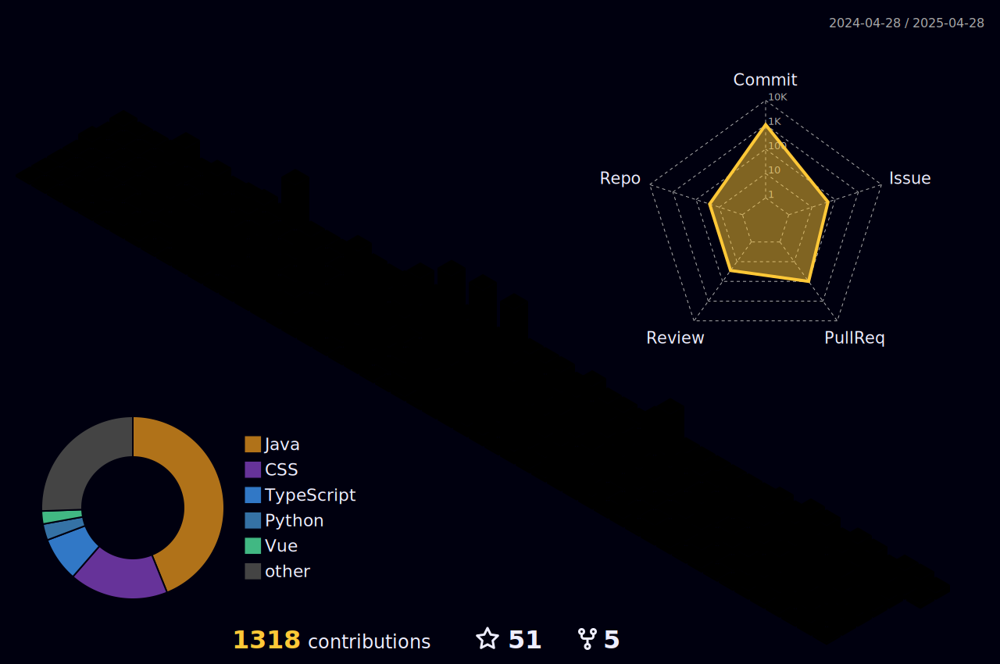

<!--<p align="center">

</p>

<p align="center">

</p>-->

## ✨ About me

<details>
<summary>Hi , I'm Pleasurecruise</summary>



</details>

<p align="left">  </p>

- 🌱 I’m currently learning React, Golang & Machine Learning ...
- 👯 I’m studying in the University of Nottingham
- 🔭 I'm major in Computer Science Artifical Intelligence 2+2
- 😎 You can know me better by my blog below:
  - Tech Blog: https://github.yiming1234.cn
- Junior year of undergraduate studies (September 2025). Any shortcomings are kindly overlooked.

## Weekly development
<!--START_SECTION:waka-->

```rust
From: 18 July 2024 - To: 17 August 2025

Total Time: 1,096 hrs 3 mins

TypeScript                         302 hrs 19 mins >>>>>>>------------------   27.50 %
Java                               232 hrs 9 mins  >>>>>--------------------   21.12 %
Python                             88 hrs 52 mins  >>-----------------------   08.08 %
Vue.js                             84 hrs 29 mins  >>-----------------------   07.68 %
Markdown                           53 hrs 33 mins  >------------------------   04.87 %
JavaScript                         49 hrs 7 mins   >------------------------   04.47 %
Text                               29 hrs 30 mins  >------------------------   02.68 %
Assembly                           21 hrs 5 mins   -------------------------   01.92 %
```

<!--END_SECTION:waka-->

## Recent Activity

| <a href="https://blog.yiming1234.cn"></a> | <a href="https://blog.yiming1234.cn"></a> |
| ------------- | ------------- |

<!--START_SECTION:activity-->
1. 🗣 Commented on [#9391](https://github.com/CherryHQ/cherry-studio/issues/9391#issuecomment-3215306018) in [CherryHQ/cherry-studio](https://github.com/CherryHQ/cherry-studio)
2. 🗣 Commented on [#9377](https://github.com/CherryHQ/cherry-studio/issues/9377#issuecomment-3215304786) in [CherryHQ/cherry-studio](https://github.com/CherryHQ/cherry-studio)
3. 🗣 Commented on [#9409](https://github.com/CherryHQ/cherry-studio/pull/9409#issuecomment-3215296158) in [CherryHQ/cherry-studio](https://github.com/CherryHQ/cherry-studio)
4. 🗣 Commented on [#9422](https://github.com/CherryHQ/cherry-studio/issues/9422#issuecomment-3215283341) in [CherryHQ/cherry-studio](https://github.com/CherryHQ/cherry-studio)
5. 🗣 Commented on [#9431](https://github.com/CherryHQ/cherry-studio/issues/9431#issuecomment-3215271884) in [CherryHQ/cherry-studio](https://github.com/CherryHQ/cherry-studio)
<!--END_SECTION:activity-->
