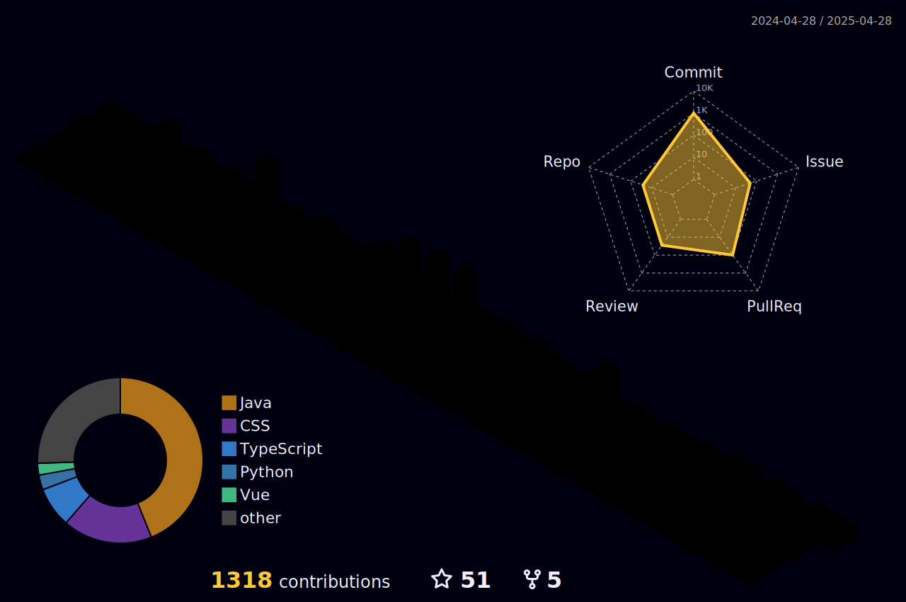

<details>
<summary>Hi there , I'm Pleasurecruise</summary>



</details>

## ✨ About me

</img>

<p align="left">  </p>

- 🌱 I’m currently learning Vue.js,SpringBoot,C++
- 👯 I’m studying in University of Nottingham Ningbo China
- 🔭 I'm major in Computer Science Artifical Intelligence 2+2
- 📫 You can reach me by url below:
  - My Blog Website: https://blog.yiming1234.cn
  - My CSDN Blog: https://yiming1234.blog.csdn.net
  - My Email:Pleasure@yiming1234.cn
  - My QQ mail:pleasurecruise@qq.com
- It's my pleasure to see you follow me!

## Weekly development
<!--START_SECTION:waka-->

```rust
From: 18 July 2024 - To: 05 October 2024

Total Time: 200 hrs 33 mins

Java                     72 hrs 6 mins   >>>>>>>>>----------------   35.91 %
Vue.js                   38 hrs 11 mins  >>>>>--------------------   19.02 %
JavaScript               29 hrs 24 mins  >>>>---------------------   14.65 %
C++                      7 hrs 47 mins   >------------------------   03.88 %
XML                      7 hrs 42 mins   >------------------------   03.84 %
Python                   7 hrs 36 mins   >------------------------   03.79 %
TypeScript               6 hrs 52 mins   >------------------------   03.42 %
Markdown                 3 hrs 21 mins   -------------------------   01.67 %
```

<!--END_SECTION:waka-->

## 📕 Blog posts
<!-- BLOG-POST-LIST:START -->- [前端工具专有名词记录](https://blog.yiming1234.cn/index.php/2024/%e5%89%8d%e7%ab%af%e5%b7%a5%e5%85%b7%e4%b8%93%e6%9c%89%e5%90%8d%e8%af%8d%e8%ae%b0%e5%bd%95/?utm_source=rss&utm_medium=rss&utm_campaign=%25e5%2589%258d%25e7%25ab%25af%25e5%25b7%25a5%25e5%2585%25b7%25e4%25b8%2593%25e6%259c%2589%25e5%2590%258d%25e8%25af%258d%25e8%25ae%25b0%25e5%25bd%2595) 
- [IDEA实现SpringBoot项目的自打包自发布自部署](https://blog.yiming1234.cn/index.php/2024/idea%e5%ae%9e%e7%8e%b0springboot%e9%a1%b9%e7%9b%ae%e7%9a%84%e8%87%aa%e6%89%93%e5%8c%85%e8%87%aa%e5%8f%91%e5%b8%83%e8%87%aa%e9%83%a8%e7%bd%b2/?utm_source=rss&utm_medium=rss&utm_campaign=idea%25e5%25ae%259e%25e7%258e%25b0springboot%25e9%25a1%25b9%25e7%259b%25ae%25e7%259a%2584%25e8%2587%25aa%25e6%2589%2593%25e5%258c%2585%25e8%2587%25aa%25e5%258f%2591%25e5%25b8%2583%25e8%2587%25aa%25e9%2583%25a8%25e7%25bd%25b2) 
- [IDEA实现NPM项目的自打包自发布自部署](https://blog.yiming1234.cn/index.php/2024/idea%e5%ae%9e%e7%8e%b0npm%e9%a1%b9%e7%9b%ae%e7%9a%84%e8%87%aa%e6%89%93%e5%8c%85%e8%87%aa%e5%8f%91%e5%b8%83%e8%87%aa%e9%83%a8%e7%bd%b2/?utm_source=rss&utm_medium=rss&utm_campaign=idea%25e5%25ae%259e%25e7%258e%25b0npm%25e9%25a1%25b9%25e7%259b%25ae%25e7%259a%2584%25e8%2587%25aa%25e6%2589%2593%25e5%258c%2585%25e8%2587%25aa%25e5%258f%2591%25e5%25b8%2583%25e8%2587%25aa%25e9%2583%25a8%25e7%25bd%25b2) 
- [如何在JetBrains中写Codeforce？](https://blog.yiming1234.cn/index.php/2024/%e5%a6%82%e4%bd%95%e5%9c%a8jetbrains%e4%b8%ad%e5%86%99codeforce%ef%bc%9f/?utm_source=rss&utm_medium=rss&utm_campaign=%25e5%25a6%2582%25e4%25bd%2595%25e5%259c%25a8jetbrains%25e4%25b8%25ad%25e5%2586%2599codeforce%25ef%25bc%259f) 
- [我给我的学校写了个校园墙小程序](https://blog.yiming1234.cn/index.php/2024/%e6%88%91%e7%bb%99%e6%88%91%e7%9a%84%e5%ad%a6%e6%a0%a1%e5%86%99%e4%ba%86%e4%b8%aa%e6%a0%a1%e5%9b%ad%e5%a2%99%e5%b0%8f%e7%a8%8b%e5%ba%8f/?utm_source=rss&utm_medium=rss&utm_campaign=%25e6%2588%2591%25e7%25bb%2599%25e6%2588%2591%25e7%259a%2584%25e5%25ad%25a6%25e6%25a0%25a1%25e5%2586%2599%25e4%25ba%2586%25e4%25b8%25aa%25e6%25a0%25a1%25e5%259b%25ad%25e5%25a2%2599%25e5%25b0%258f%25e7%25a8%258b%25e5%25ba%258f) 
<!-- BLOG-POST-LIST:END -->

## Recent Activity

| <a href="https://blog.yiming1234.cn"></a> | <a href="https://blog.yiming1234.cn"></a> |
| ------------- | ------------- |

## Top Repositories

<a href="https://github.com/CompPsyUnion/NottinghamWall">
  
</a>
<a href="https://github.com/CompPsyUnion/electricCharge">
  
</a>

## 🔗 Connact with me

<p align="left">
<a href="https://linkedin.com/in/yiming wang" target="blank"></a>
<a href="https://fb.com/wang yiming" target="blank"></a>
<a href="https://instagram.com/yiming0305" target="blank"></a>
<a href="https://codeforces.com/profile/pleasure1234" target="blank"></a>
<a href="https://www.leetcode.com/pleasure1234" target="blank"></a>
</p>

## Buy me a Coffee

<p><a href="https://www.buymeacoffee.com/pleasurecruise"> </a></p>
